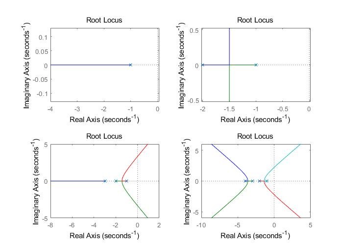
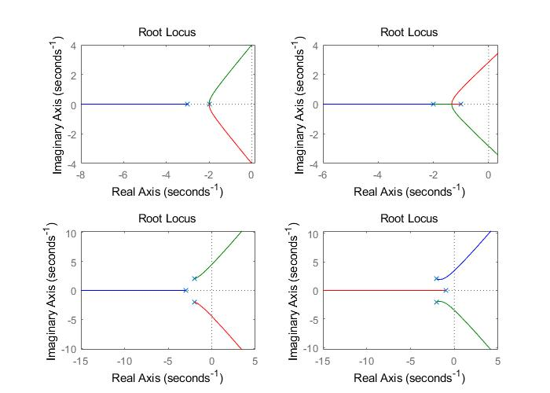
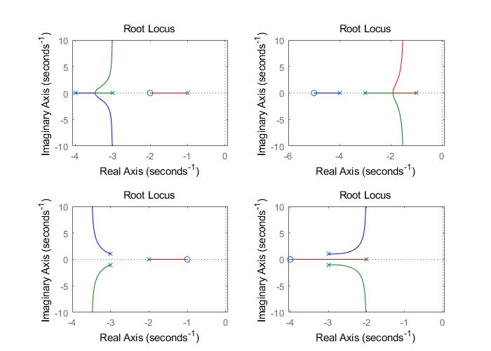
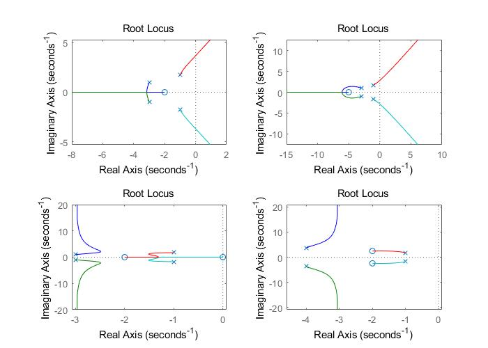
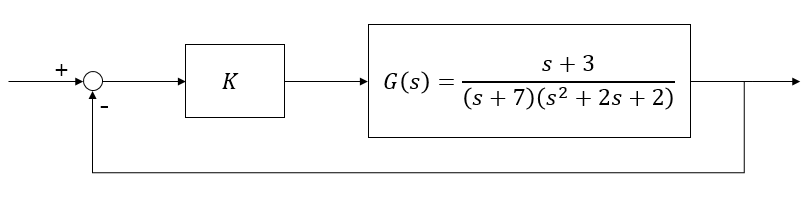
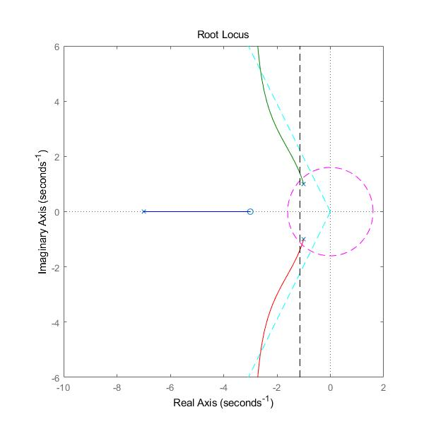
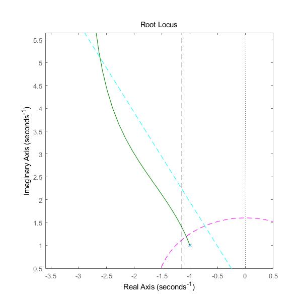
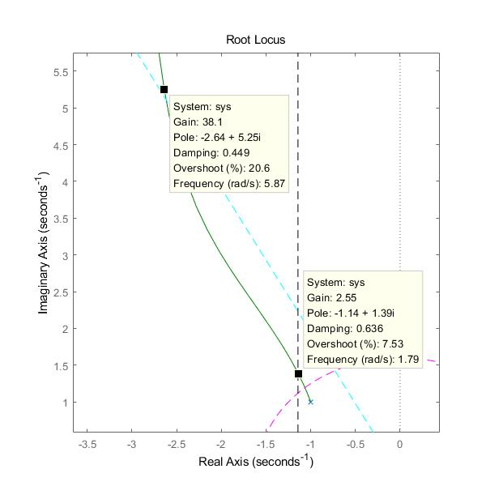

# Root Locus

학습 목표: 매틀랩을 이용해 근궤적을 그리고 제어기의 이득을 설계  

## 1. 매틀랩으로 근궤적 그리기

핵심 함수: `rlocus`  
근궤적을 그리는 간단한 예시


```matlab
s = tf('s');
sys = 1/(s+1);
rlocus(sys)
```

다양한 전달함수에 대한 근궤적 예시

1. 실수 극점만 있을 경우
    ```matlab
    % e05_rlocus_A.m
    clc; clear
    
    disp('systems with only real poles')
    s = tf('s');
    sys1 = 1/(s+1);
    sys2 = 1/((s+1)*(s+2));
    sys3 = 1/((s+1)*(s+2)*(s+3));
    sys4 = 1/((s+1)*(s+2)*(s+3)*(s+4));
    
    figure(1)
    set(gcf,'Position',[100 300 700 500])
    subplot(2,2,1)
    rlocus(sys1)
    subplot(2,2,2)
    rlocus(sys2)
    subplot(2,2,3)
    rlocus(sys3)
    subplot(2,2,4)
    rlocus(sys4)
    pause
    ```
    결과

    

2. 극점이 실수와 복소수 모두 있는 경우
    ```matlab
    % continued code
    disp('systems with real and complex poles')
    sys1 = 1/((s+3)*(s^2+4*s+4));
    sys2 = 1/((s+1)*(s^2+4*s+4));
    sys3 = 1/((s+3)*(s^2+4*s+8));
    sys4 = 1/((s+1)*(s^2+4*s+8));
    
    subplot(2,2,1)
    rlocus(sys1)
    subplot(2,2,2)
    rlocus(sys2)
    subplot(2,2,3)
    rlocus(sys3)
    subplot(2,2,4)
    rlocus(sys4)
    pause
    ```
    결과
    
    

3. 실수 복소수 극점 + 실수 영점
    ```matlab
    % continued code
    disp('systems with real and complex poles and zeros')
    sys1 = (s+2)/((s+1)*(s+3)*(s+4));
    sys2 = (s+5)/((s+1)*(s+3)*(s+4));
    sys3 = (s+1)/((s+2)*(s^2+6*s+10));
    sys4 = (s+4)/((s+2)*(s^2+6*s+10));
    
    subplot(2,2,1)
    rlocus(sys1)
    subplot(2,2,2)
    rlocus(sys2)
    subplot(2,2,3)
    rlocus(sys3)
    subplot(2,2,4)
    rlocus(sys4)
    pause
    ```
    결과
    
    
    
4. 기타 다양한 케이스들
    ```matlab
    % continued code
    disp('other cases')
    sys1 = (s+2)/((s^2+2*s+4)*(s^2+6*s+10));
    sys2 = (s+5)/((s^2+2*s+4)*(s^2+6*s+10));
    sys3 = s*(s+2)/((s^2+2*s+4)*(s^2+6*s+10));
    sys4 = (s^2+4*s+10)/((s^2+2*s+4)*(s^2+8*s+30));
    
    subplot(2,2,1)
    rlocus(sys1)
    subplot(2,2,2)
    rlocus(sys2)
    subplot(2,2,3)
    rlocus(sys3)
    subplot(2,2,4)
    rlocus(sys4)
    ```
    결과
    
    


## 2. 근궤적을 이용한 제어기 설계

다음과 같은 시스템이 있을 때 아래 조건을 만족하는 제어기의 상수 이득 K 값의 범위를 구하여라.


- 상승시간: 1.5초 이하
- 최대초과: 20% 이하
- 정착시간: 3.5초 이하

이를 풀기 위해서는 먼저 시스템의 조건을 2차 표준시스템의 제동비와 고유주파수에 대한 조건으로 바꿔야 한다.  
s-plane에서 근궤적과 조건이 나타내는 범위를 선으로 표시한 후 조건을 만족하는 범위의 근궤적을 클릭하여 그 점에서의 상수 이득 값과 극점의 값을 확인한다.   

```matlab
% e05_rlocus_B.m
clc; clear

disp('system with 3 poles and 1 zero')
s = tf('s');
sys = (s+3)/((s+7)*(s^2+2*s+2));

figure(1)
rlocus(sys)
axis([-10 2 -6 6])
set(gcf,'Position',[100 100 800 800])

tr = 1.5;   % 상승시간 1.5초 이하
Mp = 0.2;   % overshoot 20% 이하
ts = 3.5;   % 정착시간 3.5초 이하

% 2.4/wn < tr  ->  wn > 2.4/tr
wn_tr = 2.4/tr
% exp(-zeta*pi / sqrt(1-zeta^2)) < Mp
% ->  zeta^2 > (lnM)^2 / ((lnM)^2 + pi^2)
zeta_Mp = abs(log(Mp) / sqrt(log(Mp)^2 + pi^2))
theta_Mp = asin(zeta_Mp)
% 4/sig < ts  ->  sig > 4/ts
sig_ts = 4/ts

% circle with radius wn_tr
a = 0:0.01:2*pi;
x = wn_tr*cos(a);
y = wn_tr*sin(a);
hold on
plot(x, y, 'm--')

% line with angle theta_Mp from imaginary axis
plot([0 -100*sin(theta_Mp)], [0  100*cos(theta_Mp)], 'c--')
plot([0 -100*sin(theta_Mp)], [0 -100*cos(theta_Mp)], 'c--')

% line s=-sig
plot([-sig_ts, -sig_ts], [-100, 100], 'k--')
hold off
```

실행하면 다음과 같은 화면이 나온다.


세 개의 근궤적과 세 개의 조건을 나타내는 점선을 볼 수 있다.

Figure 위쪽의 돋보기 버튼을 누르고 원하는 영역을 드래그하여 선택하면 그 부분이 확대된다.  


다시 Figure 위쪽의  `데이터 커서` 버튼을 누르고 근궤적이 조건을 만족하는 영역의 시작점과 끝점을 선택한다. 해당 점에서의 상수이득과 극점, 제동비, 고유주파수를 확인할 수 있다.   
