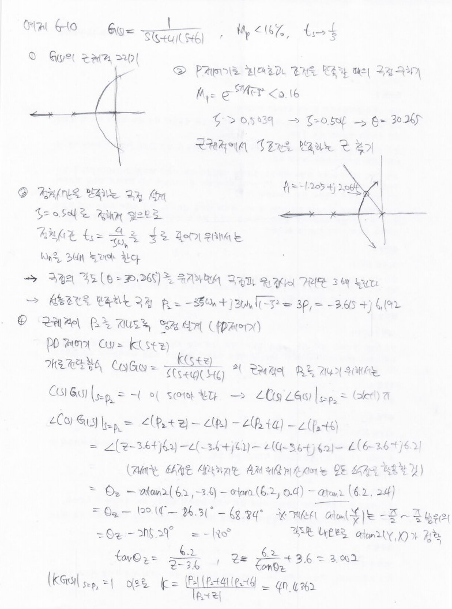
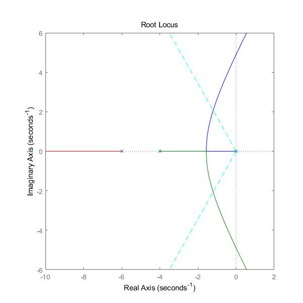
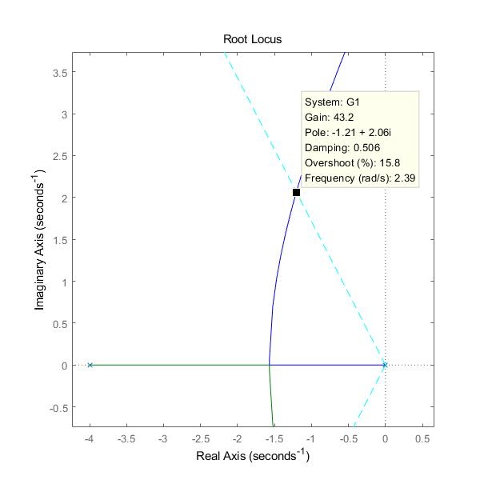
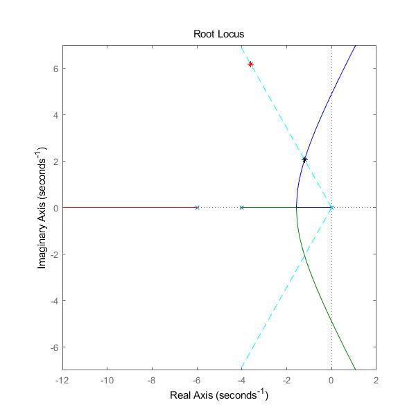
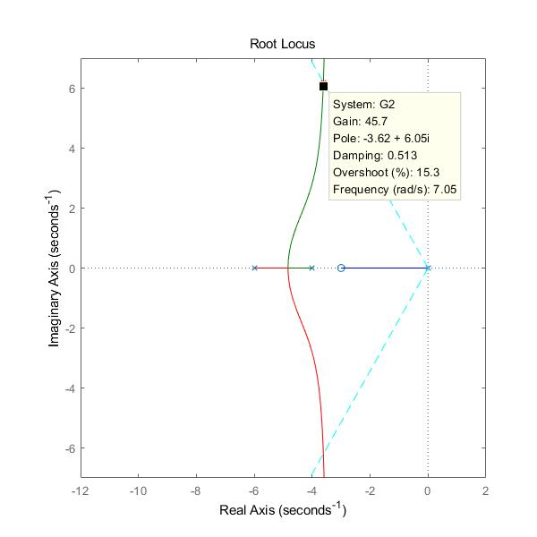

# Example 6-10

제어공학 예제 6-10을 풀이입니다.


제어공학 예제 6-10을 푸는 코드입니다.

```matlab
clc; clear

s = tf('s');
G1 = 1/(s*(s+4)*(s+6));

disp('root locus 그리기')
figure(1)
rlocus(G1)
axis([-12 2 -7 7])
set(gcf,'Position',[300 300 600 600])
hold on

disp('Mp로부터 zeta 계산')
Mp = 0.16;
v1 = log(Mp);
zeta_Mp = sqrt(v1^2/(pi^2+v1^2))
disp('조건을 만족하는 zeta를 선택')
zeta = 0.504
theta = asin(zeta);
plot([0 -100*sin(theta)], [0  100*cos(theta)], 'c--')
plot([0 -100*sin(theta)], [0 -100*cos(theta)], 'c--')

disp('근궤적에서 Mp 조건을 만족하는 극점 선택')
p1 = [-1.205, 2.064]
plot(p1(1), p1(2), '*k')

disp('상승시간을 1/3로 줄이는 극점 설계')
p2 = p1*3
plot(p2(1), p2(2), '*r')
hold off


disp('위상조건에 의한 영점의 위상 계산')
ang_G1 = -atan2(p2(2), p2(1)) - atan2(p2(2), p2(1)+4) ...
            - atan2(p2(2), p2(1)+6);
ang_G1 = ang_G1;
% theta_z + ang_G1 = -180
theta_z = -pi - ang_G1;
theta_z_deg = rad2deg(theta_z)
zero = p2(2)/tan(theta_z) - p2(1)

G2 = (s+zero)/(s*(s+4)*(s+6));
disp('root locus 그리기')
figure(2)
rlocus(G2)
axis([-12 2 -7 7])
set(gcf,'Position',[900 300 600 600])
hold on
plot(p2(1), p2(2), '*r')
hold off

K = sqrt(p2(1)^2 + p2(2)^2) * sqrt((4+p2(1))^2 + p2(2)^2) ...
    * sqrt((6+p2(1))^2 + p2(2)^2) / sqrt((zero+p2(1))^2 + p2(2)^2)
```

결과 이미지 입니다.

기본 근궤적  


최대 초과를 만족하는 극점의 위치  


상승시간을 1/3로 줄이는 극점의 위치  


제어기 적용 후 근궤적과 성능조건을 만족하는 극점의 위치  
